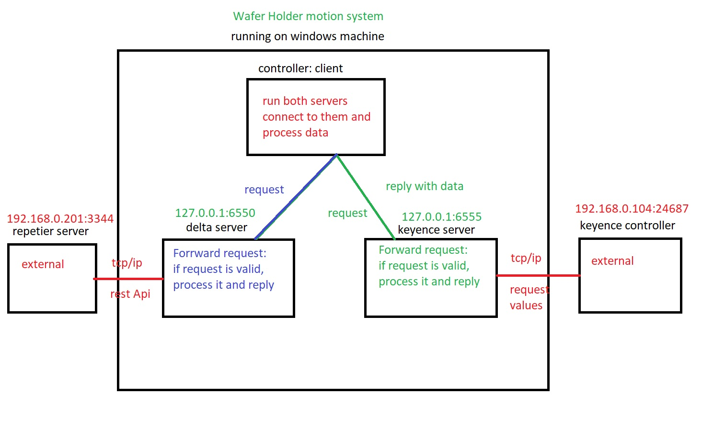
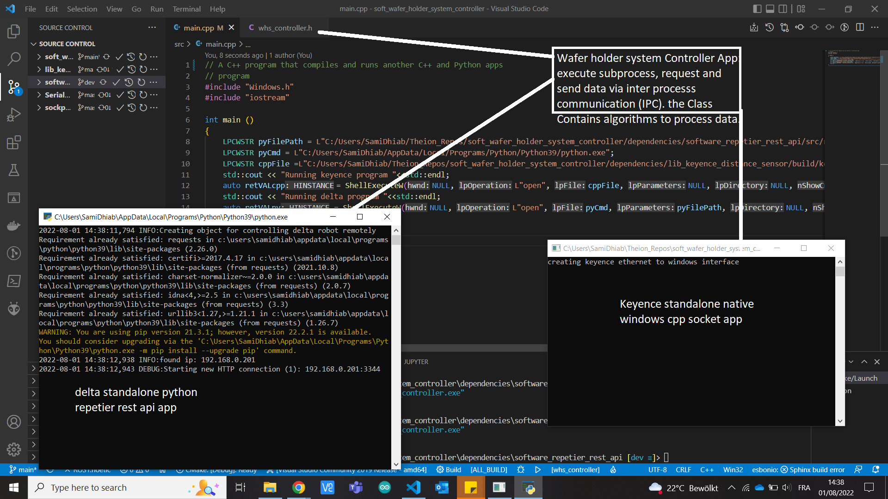
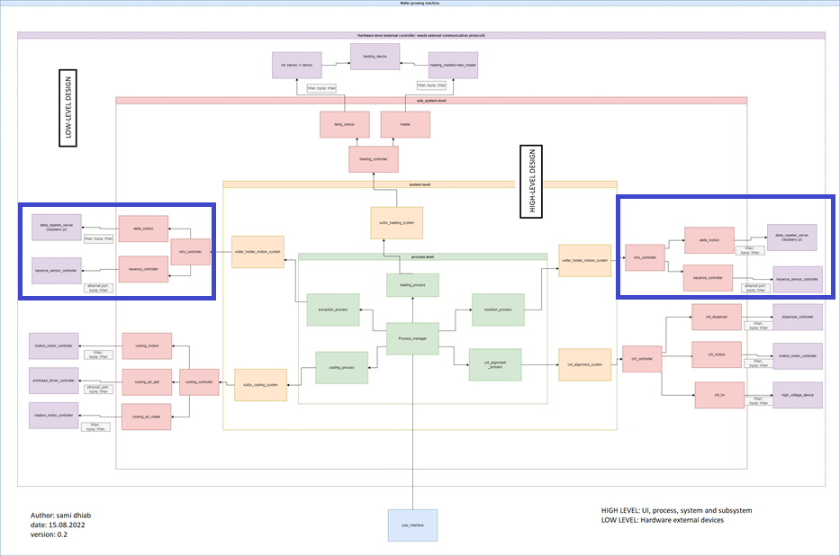

# soft_wafer_holder_system_controller
contains wafer holder system controller source code

* author: Sami dhiab
* email: sami@theion.de

## Concept (version 0.1)

the image below explains how concept is made:

the wafer holder motion system is based on two subsystem:
- delta motion system
- keyence distance sensor controller

these 2 subsystems shall run on independant processes and communicate with a controller process via socket.

the image below show some output after running first tests:

## Concept (version 0.2)

After including the keyence sdk, the server bridge in the above foto is neglected and keyence lib sdk will be directly included in the whs controller class (without server) to controll the keyence controller and get mesurement. 

## dependencies

The whs controller lib depends on:
- 1. keyence_sdk submodule: see dependecies/
- 2. software_repetier_rest_api submodule: see dependencies/
1. keyence lib rely on 3 dlls (dynamic libaries). these dlls must be included in the same folder as the .exe file (see build/debug/) for debug or (build/release/) for release version. see dependencies/lib_keyence_sdk/includes
2. repetier (delta) lib rely on:
    - pip modules: see requirements.txt
    - delta_server.py: run this server as subprocess and process data. see dependencies/software_repetier_rest_api/src/repetier_manager_lib/
## Design

the design should rely on mvc pattern (model-view-control) to comply with the high level architecture and the user interface later.
Details can be found in the parent folder.
Here we can identify our design in compliance to the higher level:

## doc and APIs
class documentation is generated by doxygen found inside docs/ .
the list of APIs to use the lib:
~~~cpp
// create wafer holder controller
whs_controller wafer_sys_control;
// keyence interface
// connect to the keyence controller
wafer_sys_control.keyence_client_connect();
// get mesured value output0
wafer_sys_control.keyence_client_get_value_output0();
// get mesured value output1
wafer_sys_control.keyence_client_get_value_output1();
// get mesured value output2
wafer_sys_control.keyence_client_get_value_output2();
// delta interface
// run delta subprocess: a server that redirects requests 
wafer_sys_control.run_delta_subprocess();
// connecto to that bridge server
wafer_sys_control.connect_to_delta_server();
// get delta current position
wafer_sys_control.get_delta_position();
~~~

## Tests
unit tests will included under tests/ folder to test teh following:
- 
- 

## Result 

The picture below show the first test result:

## How to use the app
the app is compacted inside a zip file. 
In order for the app to run properly, it needs its dependencies.
The *.dll amust be inside same folder when extracting the zip.
- running as default: double click the executable an it will run with default  parameters.
- running with user parameters: to change the sensor reference, run the app with these arguments:
~~~cmd
whs_controller.exe --sensor_ref <float value>
~~~

## Q&A
1. if cmake failed to build due to socket dependecies problems, do the following
~~~cpp
// in file dependencies/lib_keyence_distance_sensor/dependencies/sockpp/include/sockpp/platform.h
// paste these lines anywhere

/* Need to link with Ws2_32.lib, Mswsock.lib, and Advapi32.lib*/
#pragma comment (lib, "Ws2_32.lib")
#pragma comment (lib, "Mswsock.lib")
#pragma comment (lib, "AdvApi32.lib")
~~~
2. if the executable doesn't run properly, check if the dlls are put in the same folder as the .exe file